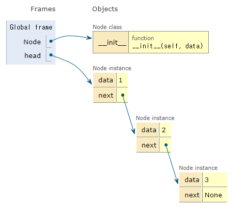
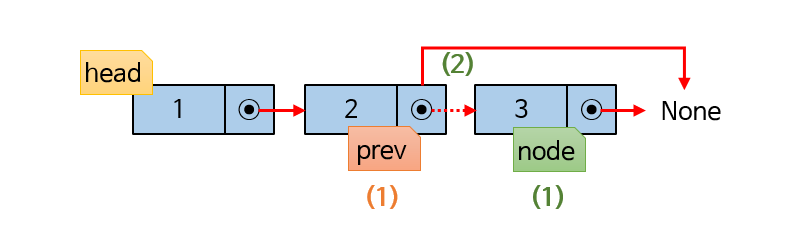
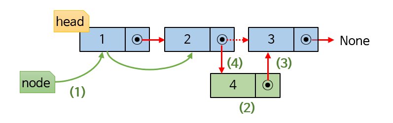

# Linked List

배열은 인덱싱으로 원소에 쉽게 접근할 수 있음

원소를 추가하거나, 삭제하는 횟수가 많을 경우 연결 리스트 사용함

### 연결 리스트 특징

- 동적 배열
- 삽입과 삭제가 쉬움
- 스택(stack), 큐(queue)등의 자료 구조를 만들 때 사용

연결 리스트의 노드는 값을 저장하는 변수와 다음 노드를 가리키고 있는 변수만 존재

-> 연결 리스트에 접근하려면 첫 노드를 가리키는 head 반드시 필요

```python
class Node:
    def __init__(self, data):
        self.data = data
        self.next = None

head = Node(1)
head.next = Node(2)
head.next.next = Node(3)
```


### 연결 리스트의 값을 출력하기

- head부터 마지막 노드까지 이동하면서 data 출력
- 이때 head는 연결 리스트의 시작이므로, head가 이동하면 연결 리스트를 잃게 됨
- 즉, 변수(이름표)를 만들고 head부터 마지막 노드까지 이동하면서 data 출력
- 마지막 노드의 next = None 이므로, 노드가 None이 아닐 동안 계속 이동하면서 data 출력

```python
class Node:
    def __init__(self, data):
        self.data = data
        self.next = None

        
head = Node(1)
head.next = Node(2)
head.next.next = Node(3)
node = head
while node:
    print(node.data, end=" ")
    node = node.next
```
### 연결 리스트의 끝에 새 노드를 추가하기

- `head.next.next... = Node(data)`를 사용하는 것을 불편함
- 연결 리스트의 값을 순서대로 출력하는 코드를 응용하여 새 노드 추가

1. 변수를 만들고 head부터 마지막 노드까지 이동
2. 마지막 노드의 next가 새 노드를 가리키도록 함

```python
class Node:
    def __init__(self, data):
        self.data = data
        self.next = None


head = Node(1)
head.next = Node(2)
head.next.next = Node(3)

node = head
while node:
    if node.next is None:
        node.next = Node(4)
        break
    node = node.next
```
위와 동일한 코드
```python
class Node:
    def __init__(self, data):
        self.data = data
        self.next = None
        
head = Node(1)
head.next = Node(2)
head.next.next = Node(3)

node = head
while node.next:
    node = node.next
node.next = Node(4)
```
### 연결 리스트의 처음에 새 노드를 추가하기
연결 리스트의 연결이 끊어지지 않도록 세 단계로 나눠서 노드를 추가함
1. 추가할 노드를 생성
2. 추가할 노드의 next가 head를 가리키게 한다.
3. head를 추가한 노드로 옮긴다

```python
class Node:
    def __init__(self, data):
        self.data = data
        self.next = None
        
head = Node(1)
head.next = Node(2)
head.next.next = Node(3)
        
node = Node(0)
node.next = head
head = node
```
## 03-01. 연결 리스트 클래스를 만들고, 노드 추가하기

단일 연결 리스트 클래스를 만들고, 관련 메서드 하나씩 만들기

### 구현 메서드 종류
- `appendleft(x)`: 연결 리스트의 처음에 x를 추가
- `append(x)`: 연결 리스트의 끝에 x를 추가
- `popleft()`: 연결 리스트에서 첫 노드의 값을 반환하고, 노드는 삭제
- `pop()`: 연결 리스트에서 마지막 노드의 값을 반환하고, 노드는 삭제
- `insert(i, x)`: 연결 리스트의 i번 인덱스에 x를 추가
- `remove(x)`: 연결 리스트에서 값이 x인 노드를 찾아 삭제
- `reverse()`: 연결 리스트를 제자리에서 순서를 뒤집음

### 특수 메소드 종류
- `__len__`: `len()`함수를 사용할 때 연결 리스트의 길이를 반환
- `__contains__`: 연산자 in과 not in을 사용할 때 연결 리스트 내의 값을 검사하여 True, False를 반환
- `__str__`: `str()`과 `print()` 함수를 사용할 때 출력할 문자열 반환

### 연결 리스트 클래스 만들기
```python
class Node:
    def __init__(self, data):
        self.data = data
        self.next = None


class LinkedList:
    def __init__(self):
        self.head = None
        self.length = 0

    # len()사용 시 연결 리스트의 길이 반환
    def __len__(self):
        return self.length
```

### `appendleft()` 메서드 만들기
- head가 None인 경우: 생성한 노드를 head에 할당

- head가 None이 아닌 경우
    1. 노드를 생성
    2. 노드의 next에 head를 할당
    3. head를 새로 만든 노드로 옮긴다
    
- 연결 리스트의 길이 증가
```python
class Node:
    def __init__(self, data):
        self.data = data
        self.next = None


class LinkedList:
    def __init__(self):
        self.head = None
        self.length = 0

    # len()사용 시 연결 리스트의 길이 반환
    def __len__(self):
        return self.length

    def appendleft(self, data):
        # head가 존재하지 않을 때, 노드 생성 후 head 지정
        if self.head is None:
            self.head = Node(data)
        # head가 존재할 때, 새로운 노드 생성 후 연결 및 head로 지정
        else:
            node = Node(data)
            node.next = self.head
            self.head = node
        self.length += 1


if __name__ == "__main__":
    my_list = LinkedList()
    print(f'연결 리스트 생성. 연결 리스트의 길이 = {len(my_list)}')
    print()
    for i in range(4):
        my_list.appendleft(i)
        print(f'{i} 추가. 연결 리스트의 길이 = {len(my_list)}')
```


### append 메서드 만들기
- head가 None일 경우: 생성한 노드를 head에 할당
- head가 None이 아닐 경우
  1. 임시 노드를 만들어 마지막 노드까지 이동
  2. 새 노드를 생성
  3. 임시 노드의 next에 새 노드 할당
- 연결 리스트의 길이 증가

```python
class Node:
    def __init__(self, data):
        self.data = data
        self.next = None


class LinkedList:
    def __init__(self):
        self.head = None
        self.length = 0

    # len()사용 시 연결 리스트의 길이 반환
    def __len__(self):
        return self.length
    
    def append(self, data):
        if self.head is None:
            self.head = Node(data)
        else:
            node = self.head
            while node.next is not None:
                node = node.next
            node.next = Node(data)
        self.length += 1
```

## 03-02. 연결 리스트의 상태를 출력하고, 값을 검색하기

### 연결 리스트 상태 출력하기

현재까지 연결 리스트 출력을 `print()`와 while문을 이용하여 진행하였음

특수 메서드인 `__str__`를 구현하여 print()함수로 연결 리스트 상태 출력

- 연결 리스트의 상태를 나타낼 문자열 변수를 만듦
- 임시 노드가 None이 아닐 동안 계속 이동하면서 아래 과정 반복
  - 현재 노드의 값을 문자열로 변환하여 문자열 변수에 더함
  - 임시 노드를 다음 노드로 옮김
- 문자열을 반환

```python
class Node:
    def __init__(self, data):
        self.data = data
        self.next = None


class LinkedList:
    def __init__(self):
        self.head = None
        self.length = 0

    # len()사용 시 연결 리스트의 길이 반환
    def __len__(self):
        return self.length

    def appendleft(self, data):
        # head가 존재하지 않을 때, 노드 생성 후 head 지정
        if self.head is None:
            self.head = Node(data)
        # head가 존재할 때, 새로운 노드 생성 후 연결 및 head로 지정
        else:
            node = Node(data)
            node.next = self.head
            self.head = node
        self.length += 1

    def append(self, data):
        if self.head is None:
            self.head = Node(data)
        else:
            node = self.head
            while node.next is not None:
                node = node.next
            node.next = Node(data)
        self.length += 1

    def __str__(self):
        if self.head is None:
            return 'Linked list is empty.'
        res = 'Head'
        node = self.head
        while node is not None:
            res += ' -> ' + str(node.data)
            node = node.next
        return res

if __name__ == "__main__":
    my_list = LinkedList()
    print(f'연결 리스트 생성. 연결 리스트의 길이 = {len(my_list)}')
    print(my_list)
    for i in range(4):
        if i % 2:
            my_list.append(i)
        else:
            my_list.appendleft(i)
        print(f'{i} 추가. 연결 리스트의 길이 = {len(my_list)}')
        print(my_list)
        print()
```

### 값을 검색하기

값을 비교하여 찾는 값이 있으면 True, 없으면 False 반환하도록 수정
- head가 None이면 False를 반환
- 임시 노드가 None이 아닐 동안 계속 이동하면서 아래 과정 반복
  - 현재 노드의 값이 찾는 값이면 True를 반환
  - 임시 노드를 다음 노드로 옮김
- False를 반환

```python
class Node:
    def __init__(self, data):
        self.data = data
        self.next = None


class LinkedList:
    def __init__(self):
        self.head = None
        self.length = 0

    # len()사용 시 연결 리스트의 길이 반환
    def __len__(self):
        return self.length

    def appendleft(self, data):
        # head가 존재하지 않을 때, 노드 생성 후 head 지정
        if self.head is None:
            self.head = Node(data)
        # head가 존재할 때, 새로운 노드 생성 후 연결 및 head로 지정
        else:
            node = Node(data)
            node.next = self.head
            self.head = node
        self.length += 1

    def append(self, data):
        if self.head is None:
            self.head = Node(data)
        else:
            node = self.head
            while node.next is not None:
                node = node.next
            node.next = Node(data)
        self.length += 1

    def __str__(self):
        if self.head is None:
            return 'Linked list is empty.'
        res = 'Head'
        node = self.head
        while node is not None:
            res += ' -> ' + str(node.data)
            node = node.next
        return res

    def __contains__(self, target):
        if self.head is None:
            return False
        node = self.head
        while node is not None:
            if node.data == target:
                return True
            node = node.next
        return False

if __name__ == "__main__":
    import random
    data = list(range(10, 20))
    random.shuffle(data)
    my_list = LinkedList()
    for i in data:
        my_list.append(i)
    print(f'연결 리스트의 상태\n{my_list}')
    print()
    for _ in range(4):
        i = random.randint(5, 25)
        if i in my_list:
            print(f'{i} 있음')
        else:
            print(f'{i} 없음')
```

## 03-03. 연결 리스트에서 노드 꺼내기

### popleft 메서드 만들기


연결 리스트에서 노드를 삭제하는 것은 복잡함

고려해야 할 것이 있음

head: queue의 rare, stack의 top과 같은 개념이라고 생각하면 될 듯

연결 리스트의 첫 노드를 꺼내면, head는 다음 노드로 이동해야 함

첫 노드의 값을 반환하려면, head를 옮기기 전에 첫 노드를 임시 노드에 할당해야 함

- head가 None이면 None을 반환
  - 임시 노드를 만들고, head를 할당
  - head를 head의 다음 노드로 이동.
  - 노드가 하나만 있을 때, 다음 노드는 None이므로 첫 노드를 꺼내면서 head를 다음 노드로 옮기면 head는 None을 가리킴
- 연결 리스트의 길이를 하나 줄임
- 임시 노드에 할당한 값을 반환

```python
class Node:
    def __init__(self, data):
        self.data = data
        self.next = None


class LinkedList:
    def __init__(self):
        self.head = None
        self.length = 0

    # len()사용 시 연결 리스트의 길이 반환
    def __len__(self):
        return self.length

    def popleft(self):
        if self.head is None:
            return None
        node = self.head
        self.head = self.head.next
        self.length -= 1
        return node.data


if __name__ == "__main__":
    import random
    data = list(range(10, 20))
    random.shuffle(data)
    my_list = LinkedList()
    for i in data:
        my_list.append(i)
    print(f'연결 리스트의 상태\n{my_list}')
    print()
    for _ in range(len(my_list)):
        print(f'{my_list.popleft()} 꺼낸 후의 길이 = {len(my_list)}, {my_list}')
    print(f'연결 리스트가 비었을 때 꺼낸 값은 {my_list.popleft()}')
```

### pop 메서드 만들기

pop메서드는 가장 복잡하다!!!!



- head가 None이면 None을 반환
- 임시 노드 두 개 (node, prev)를 만듦
  1. node에 head를 할당한 후 마지막 노드까지 이동
    1-1. 이때 prev는 node의 이전 노드를 가리키도록 이동
  2. prev의 next가 None을 가리키도록 함
- 연결 리스트의 길이를 하나 줆임
- node의 값을 반환

```python
class Node:
    def __init__(self, data):
        self.data = data
        self.next = None


class LinkedList:
    def __init__(self):
        self.head = None
        self.length = 0

    # len()사용 시 연결 리스트의 길이 반환
    def __len__(self):
        return self.length


    def pop(self):
        if self.head is None:
            return None
        # self.head는 건드리는 것 아님
        node = self.head
        while node.next is not None:
            prev = node
            node = node.next
        if node == self.head:
            self.head = None
        else:
            # 다음 노드 끊기
            prev.next = None
        self.length -= 1
        return node.data


if __name__ == "__main__":
    import random
    data = list(range(10, 15))
    random.shuffle(data)
    my_list = LinkedList()
    for i in data:
        my_list.append(i)
    print(f'연결 리스트의 상태\n{my_list}')
    print()
    for _ in range(len(my_list)):
        print(f'{my_list.pop()} 꺼낸 후의 길이 = {len(my_list)}, {my_list}')
    print(f'연결 리스트가 비었을 때 꺼낸 값은 {my_list.pop()}')
```

## 03-04. 임의 위치에 노드를 추가하고, 노드 삭제하기

### remove 메서드 만들기

특정 노드를 삭제하는 메서드 만들기

`__contains__`, `popleft`, `pop` 적절히 섞어서 사용


- 임시 노드 두 개(node, prev) 만들기
  1. node는 삭제할 원소를 찾아서 이동하고, prev는 그 뒤
  2. 삭제할 원소 찾았으면, prev의 next = node.next를 가리키도록 함. True 반환
- 연결 리스트가 비었거나, 삭제할 노드 없으면 = False 반환
- 삭제할 원소가 head일 때와 head가 아닐 때를 구분해야 함

```python
class Node:
    def __init__(self, data):
        self.data = data
        self.next = None


class LinkedList:
    def __init__(self):
        self.head = None
        self.length = 0

    # len()사용 시 연결 리스트의 길이 반환
    def __len__(self):
        return self.length

    def remove(self, target):
        node = self.head
        while node is not None and node.data != target:
            prev = node
            node = node.next
        if node is None:
            return False
        # head가 target일 경우
        if node == self.head:
            # head를 날려버림
            self.head = self.head.next
        # head가 target이 아닐 경우
        else:
            # prev - node - node.next 를
            # prev - node.next 변경
            prev.next = node.next
        self.length -= 1
        return True


if __name__ == "__main__":
    import random
    data = list(range(10, 15))
    random.shuffle(data)
    my_list = LinkedList()
    for i in data:
        my_list.append(i)
    print(f'연결 리스트의 상태\n{my_list}')
    print()
    # remove 시도 횟수 = 5
    for _ in range(5):
        i = random.randint(10, 15)
        if my_list.remove(i):
            print(f'{i} 연결 리스트에서 삭제')
            print(f'연결 리스트의 길이 = {len(my_list)}, {my_list}\n')
        else:
            print(f'{i} 연결 리스트에 없음')
```

### insert 메서드 만들기

특정 인덱스에 노드를 삽입



- 인덱스가 0보다 작게 주어지면, 인덱스 0에 새 노드 삽입 -> appendleft 사용
- 인덱스가 연결 리스트의 길이보다 클 경우, 연결 리스트의 끝에 새 노드 삽입 -> append 사용

1. 임시 노드를 만들고, 삽입할 위치 전까지 이동
2. 삽입할 노드 생성
3. 새 노드의 next가 임시 노드의 다음 노드를 가리킴
4. 임시 노드의 next가 새 노드를 가리킴

```python
class Node:
    def __init__(self, data):
        self.data = data
        self.next = None


class LinkedList:
    def __init__(self):
        self.head = None
        self.length = 0

    # len()사용 시 연결 리스트의 길이 반환
    def __len__(self):
        return self.length

    def appendleft(self, data):
        # head가 존재하지 않을 때, 노드 생성 후 head 지정
        if self.head is None:
            self.head = Node(data)
        # head가 존재할 때, 새로운 노드 생성 후 연결 및 head로 지정
        else:
            node = Node(data)
            node.next = self.head
            self.head = node
        self.length += 1

    def append(self, data):
        if self.head is None:
            self.head = Node(data)
        else:
            node = self.head
            while node.next is not None:
                node = node.next
            node.next = Node(data)
        self.length += 1

    def insert(self, i, data):
        if i <= 0:
            self.appendleft(data)
        elif i >= self.length:
            self.append(data)
        else:
            node = self.head
            # 인덱스 범위 설정 유의하기
            for _ in range(i-1):
                node = node.next
            new_node = Node(data)
            new_node.next = node.next
            node.next = new_node
            self.length += 1


if __name__ == "__main__":
    import random
    data = list(range(10, 15))
    random.shuffle(data)
    my_list = LinkedList()
    for i in data:
        my_list.append(i)
    print(f'연결 리스트의 상태\n연결 리스트의 길이 = {len(my_list)}')
    print()

    for _ in range(5):
        i = random.randrange(10)
        data = random.randint(10, 20)
        my_list.insert(i, data)
        print(f'{data} 연결 리스트의 {i} 인덱스에 삽입')
        print(f'연결 리스트의 길이 = {len(my_list)}, {my_list}\n')
```

## 03-05. 연결 리스트 뒤집기

reverse 메서드를 구현해보자

### 연결 리스트를 뒤집는 과정

- 임시 노드 prev와 ahead를 만듦
- prev에 None을 할당하고, ahead에는 head의 다음 노드 할당
- ahead가 None이 아닐 동안 반복
  1. head의 next가 prev를 가리키게 함
  2. prev를 head로 옮김
  3. head를 ahead로 옮김
  4. ahead를 ahead의 다음 노드로 옮김
  
```python
class Node:
    def __init__(self, data):
        self.data = data
        self.next = None


class LinkedList:
    def __init__(self):
        self.head = None
        self.length = 0

    # len()사용 시 연결 리스트의 길이 반환
    def __len__(self):
        return self.length

    def reverse(self):
        if self.length < 2:
            return
        prev = None
        ahead = self.head.next
        while ahead:
            self.head.next = prev
            prev = self.head
            self.head = ahead
            ahead = ahead.next
        self.head.next = prev


if __name__ == "__main__":
    my_list = LinkedList()
    for i in range(10):
        my_list.append(i)
    print(f'연결 리스트의 상태\n연결 리스트의 길이 = {len(my_list)}, {my_list}')
    print()
    my_list.reverse()
    print(f'연결 리스트를 뒤집은 후\n연결 리스트의 길이 = {len(my_list)}, {my_list}')
```